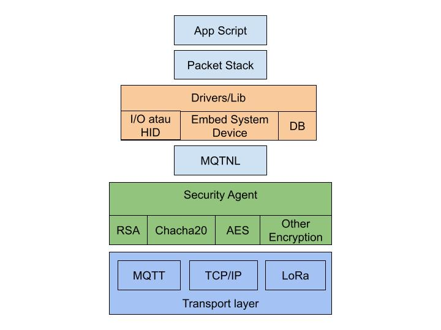
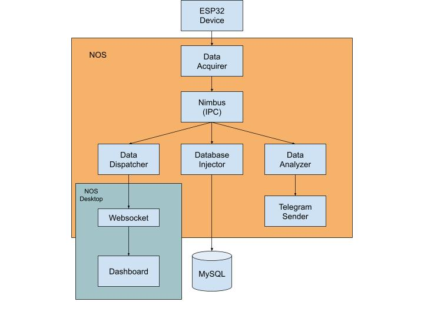

# NOS (Node-Oriented System)

NOS (Singkatan dari Node-Oriented System) adalah sebuah platform scripting modular untuk IoT dan otomasi, NOS berbasis NodeJS tetapi seluruh script, komponen, library dan modulnya disimpan kedalam bentuk file tunggal semacam virtual file system (untuk selanjutnya kita sebut saja BFS) berbasis SQLite.

NOS memliki semacam terminal untuk mengakses shell yang disediakan, terminal ini adalah antarmuka utama dengan user untuk melakukan beberapa operasi seperti menjalankan script, operasi file (ls, cp, cat, rm dsb), mengatur konfigurasi, memeriksa log dan lainnya.

---

## Komunikasi dan Keamanan

Komunikasi di NOS pada dasarnya berbasis **MQTT** tetapi di kemas ulang kedalam protokol sendiri yang di sebut **MQTNL (MQTT Network Library)**. Pada praktiknya, komunikasi bukan berdasarkan topic sebagai identifier pesannya melainkan berbasis **address** dan **port**. Bentuk address disini dalam format string alfanumerik, sedangkan port berupa angka bulat.

Setiap satu unit NOS yang dijalankan dapat memiliki lebih dari satu address untuk berbagai keperluan, dan setiap address bisa menghandle beberapa koneksi yang di identifikasi dengan nomor port.

Sekuriti di NOS ditangani oleh **security agent** dimana komponen ini bertanggung jawab membungkus paket data dengan enkripsi sebelum dikirim oleh MQTNL dan membuka bungkusan ter-enkripsi yang diterima MQTNL sebelum diserahkan ke script penerima. Security agent dapat di custom atau ditambah dengan jenis enkripsi tertentu dan kemudian di register di NOS agar bisa digunakan oleh MQTNL sebagai data guardian. Karena arsitektur NOS dibangun dengan komponen yang sangat modular sehingga konfigurasi seperti MQTNL yang ingin menggunakan security agent tertentu tidak perlu ditanam secara hard-coded didalam script melainkan cukup di edit didalam file konfigurasi.

---

## Arsitektur Modular

Seperti yang disebutkan sebelumnya pada dasarnya NOS didesain dengan pendekatan yang modular, setiap komponen dibagi kedalam banyak file script terpisah sesuai dengan fungsi dan tugasnya. Singkatnya NOS memiliki filosofi: **“Do it one thing and do it well”**, ya memang meniru filisofinya UNIX. Ini menjadi penting sekali dalam pengembangan sistem yang scalable dan terus berkembang tetapi dengan tetap memperhatikan mitigasi dimana ada konflik atau bug kita bisa dengan mudah memilah area mana yang berpotensi bermasalah dan melakukan isolasi dalam proses tracing dan debuging.



---

## Abstraksi Sumber Daya

NOS memiliki komponen yang disebut **device driver**. Ini adalah pendekatan abstraksi sumber daya sistem yang akan diakses script atau komponen NOS. Abstraksi menjadi bagian penting lainnya dimana script hanya mengenal satu antarmuka seperti akses ke file, akses ke hardware misalnya serial, websocket, bahkan display dan keyboard dipandang sebagai device driver. Abstraksi seperti ini memungkinkan script hanya cukup menggunakan satu perintah sebagai standarisasi, tetapi pada akhirnya NOS akan mengambil alih perintah tersebut untuk kemudian diolah dan digunakan sebagai mana mestinya.

Contoh sederhana perintah untuk menampilkan teks dilayar tidak menggunakan `console.log` atau `process.stdout.write` seperti yang biasa dilakukan tetapi menggunakan `crt.textOut` atau `crt.write`. Dengan abstraksi, perintah tidak hanya bisa ditampilkan di layar normal akan tetapi dengan mudah dialihkan ke sebuah web browser, ke layar LCD atau bahkan ke remote terminal nun jauh disana. Begitu pula keyboard dipandang sebagai device driver agar dapat juga menerima ketikan keyboard user dari NOS di seberang kota atau negara lain.

NOS memiliki shell sedemikian rupa sehingga shell ini bisa di remote dari terminal di NOS yang lain. Penggunaan NOS sebagai gateway sensor dan penyedia dashboard yang berbasiskan MQTT sebetulnya bisa saja dilakukan tanpa harus menggunakan NOS ini, tetap ada nilai lebih rasanya yang akan didapat yakni gateway yang berupa shell dapat diakses dari jarak jauh untuk keperluan monitoring, seting konfigurasi, menjalankan script baru atau update script dan tetap berbasis MQTT lewat MQTNLnya.

---

## Keamanan Remote Terminal

Sekuriti di remote terminal NOS menggunakan enkripsi asimetris **RSA** sebagai tools untuk pertukaran secret key pada awal hand-shake. Setelahnya jika secret key sudah berada di kedua pihak server dan client maka enkripsi diubah menjadi **chacha20 poly1305** yang mana jenis enkripsi simetris ini dikenal cukup kuar dan cepat. Tak lupa saat hand-shake user akan ditawari fingerprint dari public key si host shell server ini (jika memang belum tercatat di file `.nos_known_hosts`) untuk mencegah ada man in the middle yang berupaya menjadi host shell server “tiruan” dari shell server asli yang akan kita tuju. Jika belum ada data fingerprint dari shell server ini maka akan dicatat didalam file `.nos_known_hosts` untuk digunakan berikutnya jika mengakses host shell server yang sama, ini merupakan praktek umum pada komunikasi remote console pada beberapa platform OS.

---

## Implementasi dan Diagram Alur Data

Jadi pada akhirnya NOS dapat digunakan bagi mereka yang ingin mambangun sistem sensor IoT dari mulai pembuatan firmware perangkat sensornya misal ESP8266/ESP32, gateway atau listener, data loging, data analyzer hingga dashboard terpadu dalam satu platform tanpa menyewa hosting atau cloud service cukup disimpan laptop, PC atau bahkan STB berbasis armbian dirumah anda dengan syarat koneksi internet dan MQTT Broker. Ya tentu saja untuk beberapa kasus praktek seperti ini tentu tidak ideal, misalnya gangguan koneksi internet yang tidak bisa diandalkan atau gangguan pemadaman listrik atau juga keamanan servernya itu sendiri berbeda halnya jika dibandingkan dengan sewa hosting atau cloud service yang biasanya sudah mengantisipasi beberapa kekurangan tadi, tapi dengan NOS ini diharapkan menjadi alternatif mudah untuk membangun sistem IoT tanpa biaya tambahan tapi tentu dengan resiko-resiko tadi.

NOS memiliki built in listener, mekanisme data collector, data distributor dan dashboard builder, berikut adalah diagram data alurnya:



---


Langkah-langkat instalasi:

1. instalasi dependensi:
   `./tools/lib_deps.sh`

2. jalankan script instalasi:
   `node tools/installer.js`

	maka akan tampil dialog teks seperti ini:
	```
	Starting NOS Installer...
	This will migrate files to BFS and configure NOS settings.
	
	Path + nama file image BFS: [images/nos.img]: images/demo.img
	Hostname NOS: [ficus]: demo-nos
	Root password: [elastica]: ***
	Ulangi root password: [elastica]: ***
	Shell utama perlu login? (1/0): [0]: 0
	Remote shell perlu login? (1/0): [0]: 0
 	```
 3. Jika semuanya lancar maka jalankan dengan perintah:
    `node nos -f images/demo.img`
    atau bisa juga menggunakan watchdog:
    `./bootstrap.sh -f images/demo.img`

	untuk keluar dari NOS berikan perintah di shell command:
	`shutdown`
