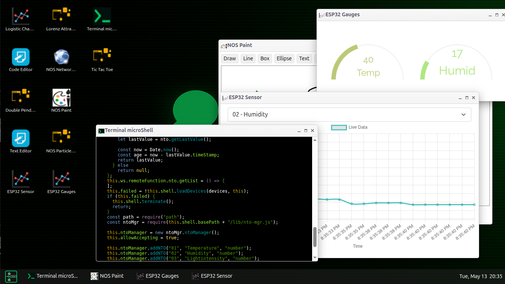
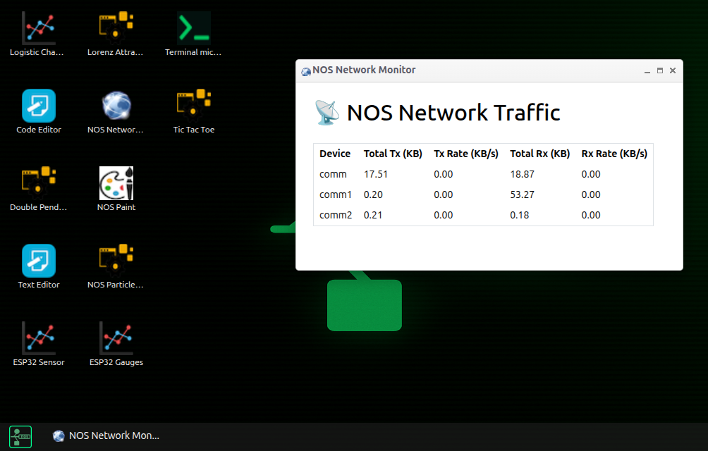
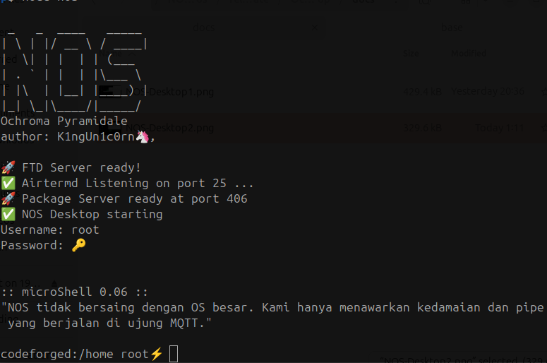

# NOS: Node-Oriented System

**Version**: Ochroma Pyramidale v1.1  
**Codename**: "The Lightweight Awakens"  
**Release Date**: May 14, 2025

> It's a node scripting framework, terminal-first, encryption-aware, modular by nature.

---

## 🌱 What is NOS?

**NOS (Node-Oriented System)**  
NOS is a lightweight, modular scripting framework for IoT communication, education, and prototyping,  
with a philosophy and experience similar to Linux OS, but running on top of MQTT Network Layer (MQTNL) and modern platforms.

---

## ✨ Main Features

- **Multi-Connection Manager:**  
  Supports multiple MQTT connections simultaneously (multi-broker, multi-security).
- **Modular Network Stack:**  
  Separate communication layers (mqtnlConnection, NOSPacketStackV2) for flexibility and security.
- **Internal Firewall:**  
  Manage allow/deny rules per device, port, and address with the `fwset` script.
- **Ping & Broadcast Scan:**  
  Ping and scan NOS nodes in the broker, similar to `ping` and `nmap` in Linux.
- **Realtime Monitoring:**  
  `nettop`/`nettopgui` apps to monitor traffic of each connection live.
- **NOS Shell & CLI:**  
  Shell scripting, commands like `ifconfig`, `fwset`, `scannos`, etc.
- **NOS Desktop (Experimental):**  
  Lightweight desktop environment with monitoring, editor, and other apps.
- **Open Source & Extensible:**  
  Easy to develop, integrate, and hack by the community.

---

## 🚀 Example Commands

```sh
ifconfig         # Show active connection managers
fwset --list     # View/manage firewall rules
scannos          # Scan other NOS nodes in the broker (like nmap)
nettop           # Monitor traffic per connection (CLI/GUI)
passwd           # Change current user password
ping <host>      # Ping another node via NOS
```

---

## ⚡ Getting Started

To set up NOS for the first time, run the following commands in your project directory:

```sh
npm install         # Download and install dependencies
./bootstrap.sh     # Initialize and start NOS
```

To access the NOS Desktop GUI, open this link in your browser:

```
<basepath>/opt/gui/NOSDesktop/index.html?address=localhost:8192
```

Replace `<basepath>` with the absolute path to your NOS installation directory.

---

## 📦 Project Structure

- `base/` : Main CLI scripts (ping, scannos, etc)
- `opt/` : Optional scripts, configuration file
- `opt/gui/` : GUI applications (nettopgui, etc)
- `lib/` : Core libraries (mqttNetworkLib.js, NOSPacketStackV2, etc)
- `dev/` : Devices & drivers
- `home/` : User space and some examples script

---

## 🛡️ License

This project is open source and licensed under the **MIT License**. Feel free to use, modify, and contribute.

---

## 📸 Screenshot

NOS Dekstop screen:


MQTNL Network Monitor:



Starting Screen:


---

## ⚠️ NOS-Desktop Security Disclaimer

NOS-Desktop uses WebSocket/HTTP for communication between the backend (Node.js) and the web browser (graphics engine).
**The IP address and WebSocket port used are the responsibility of the user/admin.**

- Make sure the port/IP is not exposed to the public network without adequate security.
- It is recommended to run NOS-Desktop on a local/isolated network.
- Use a firewall or reverse proxy to restrict access if necessary.
- All risks related to port/IP exposure are the responsibility of the user/admin.

> NOS-Desktop does not use non-TCP/IP protocols for browser ↔ backend communication, as per modern browser security restrictions.

---

## 👨‍💻 Contribution

- Pull requests, bug reports, and new feature ideas are very welcome!
- Documentation, example scripts, and new apps will greatly help the community.

---

## 📚 Documentation

Available soon.

---

## 🔄 Update NOS

To update NOS, simply type in the CLI:

```
pkg canding install system-update
```

---

## 🔑 Default Account

- **Username:** `root`
- **Password:** `canding`

> Please change your root password after first login for security reasons.
> Using CLI: passwd

---

## 🌐 MQTT Broker

By default, NOS is configured to use the MQTT broker at:

```
mqtt://62.72.31.252
```

You are free to use any MQTT broker IP or address. However, this IP is where the official NOS Canding node is running and where the repository for official system updates (`pkg canding install system-update`) is hosted.

The broker configuration can be found in:

```
opt/conf/netconf.js
```

---

## 🚧 Disclaimer & Community Call

NOS is still far from perfect and is an ongoing work in progress. We highly welcome feedback, suggestions, and contributions from the programming community to help make NOS better for everyone.

**Note:** Complete documentation is still in progress. We apologize for any inconvenience and appreciate your patience and support!

---

**NOS — Network Orchestration Framework for Everyone!**
